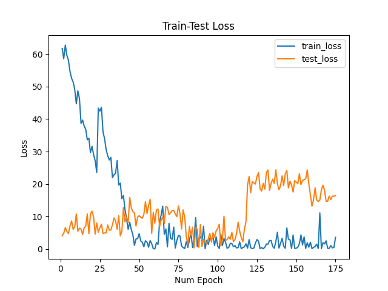

# RhythmNet
A reproduction of the RhythmNet model

#### Dataset:
VIPL-HR dataset

## Experiments
Shared parameters:
```
batch size: 32
Image dimensions (HxW): 28x28
Model: LeNet
initial learning rate: 3e-4
epochs: 10
```

**Dataset-split**: 10% for Validation
### Experiment 1

|                | **Loss** |
|----------------|----------------|
| Training set |        0.007  |
| Evaluation set |        0.031  |


